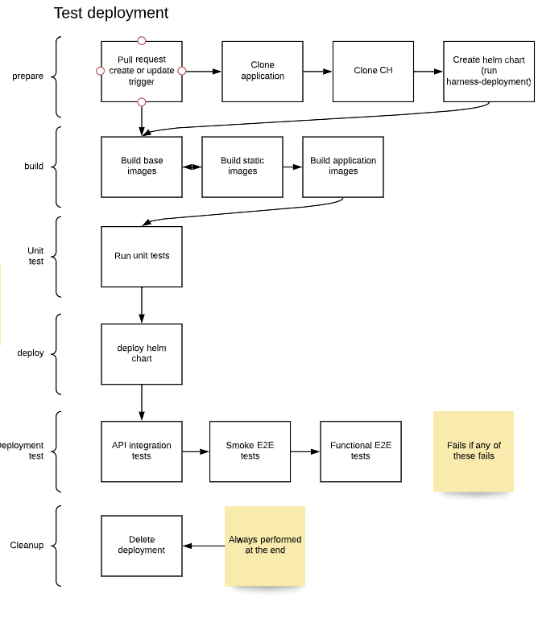

# Write and run automated tests

Testing microservices applications can be complex, as the runtime setup is 
often required to test the most complex and subtle service dependencies.

CloudHarness provides facilitators to run tests at different levels:
- **Unit tests**: stateless and/or mocked tests which don't require the deployment setup. Useful to test algorithm logic and application stack dependencies.
- **API integration tests**: test api responses in the kubernetes deployment.
- **End to end tests**: use puppeteer to test frontend applications user interaction.

To specify tests in your application, start creating a directory named `test` (e.g. `applications/myapp/test`).

Applications created with `harness-application` already include the folder structure and test stubs.

## Unit tests

Unit tests run in a container using the Docker image candidate to be deployed.
Tests can be written with any framework and can be placed anywhere within the application container:
tests must so be included in the Dockerfile specification of the application.

### Write unit tests
1. Write your tests with your framework of choice (e.g. pytest)
1. Verify your Dockerfile so that the test files are included
1. Edit the application's `values.yaml` (e.g. `applications/myapp/deploy/values.yaml`) `test.unit` section with the commands to run the tests like:

```yaml
commands:
  - pytest /usr/src/app/samples/test
```

See also [the model documentation](model/UnitTestsConfig.md)

Examples:
- [Sample application test file](../applications/samples/backend/samples/test/test_sample.py)
- [Sample application unit.yaml](../applications/samples/test/unit.yaml)

### Run unit tests in the built container

Unit tests are automatically included in the Skaffold and CI/CD pipelines. Tests run right after the build step.

## Api integration tests

Api tests use the openapi specification to run automated tests against microservices as they are deployed in a dev/test Kubernetes environment.
Tests are based on [Schemathesis](https://schemathesis.readthedocs.io/), so uses input
examples defined in the openapi specification and randomly generated sets of input to
do a series of base checks:

- `not_a_server_error`. The response has 5xx HTTP status;
- `status_code_conformance`. The response status is not defined in the API schema;
- `content_type_conformance`. The response content type is not defined in the API schema;
- `response_schema_conformance`. The response content does not conform to the schema defined for this specific response;
- `response_headers_conformance`. The response headers does not contain all defined headers.

By default, all checks are made an all the endpoints defined in the openapi file.

Edit the application's `values.yaml` (e.g. `applications/myapp/deploy/values.yaml`) `test.api` section to enable and configure api tests.

**Configuration examples**

Minimal configuration:

```yaml
harness:
  ...
  test:
    api:
      enabled: true
```
Custom configuration:

```yaml
harness:
  ...
  test:
    api:
      enabled: true
      autotest: true
      checks:
        - all
      runParams:
      - "--skip-deprecated-operations" 
      - "--hypothesis-suppress-health-check=too_slow" 
      - "--hypothesis-deadline=60000"
      - "--request-timeout=60000"
      - "--hypothesis-max-examples=2"
      - "--show-errors-tracebacks"
```

See [the model documentation](model/ApiTestsConfig.md) for more insights about parameters.


### Write API tests

Tests are defined as pytest files
In order to write end to end tests for your application (say, *myapp*) all you need to do is to create a test file inside the `test/api` folder, named following the default Pytest convention (e.g. `applications/myapp/test/api/test_myapi.py`).

Even if any pytest test can be defined, it is recommended to write Schemathesis
tests to take advantage of the Schemathesis functionalities and the
CloudHarness automations for setting authentication headers.

For more insights on how to write Schemathesis tests, see [here](https://schemathesis.readthedocs.io/en/stable/python.html).

The test can use environmental variables:

- `APP_URL`: The application public url. 
- `USERNAME`, `PASSWORD`: The main user's username and password (see also [below](#Create-test-users")). Use to get a base login.

Examples:
- [Sample api test](../applications/samples/test/api/test_st.py)


## End to end (E2E) tests

End to end tests run in a headless browser ([Puppeteer](https://github.com/puppeteer/puppeteer)) against the full deployment on Kubernetes.

Custom configuration:

```yaml
harness:
  ...
  test:
    e2e:
      # -- enable/disable e2e tests
      enabled: true
      # -- ignore errors on console by default
      ignoreConsoleErrors: false
      # -- ignore fetched resources errors by default
      ignoreRequestErrors: false
      # -- enable common smoke tests
      smoketest: true
```

### Write tests with Jest and Puppeteer

Tests are defined as pure Javascript/Typescript Jest files inside your application:
no need to create the node application as CloudHarness already defines the project, 
which is shared across all applications (if you want to know more [here it is](../test/test-e2e/README.md)).

In order to write end to end tests for your application (say, *myapp*) all you need to do is to create a test file inside the `test/e2e` folder, named following the pattern `**/?(*.)+(spec|test).[tj]s?(x)` (e.g. `applications/myapp/test/e2e/mytest.spec.ts`).

The test can use environmental variables:

- `APP_URL`: The application public url. 
- `USERNAME`, `PASSWORD`: The main user's username (see also [below](#Create-test-users")). Use to get a base login.


For instance, to get the home page, can write 
```javascript
await page.goto(process.env.APP_URL, {
        waitUntil: "networkidle0",
      })
```

Examples:
- [Sample end to end test](../applications/samples/test/e2e/samples.spec.ts)

### Common smoke tests

Once a test is created for your application, generic smoke tests are also
executed, checking for:

- Main page is reachable
- No errors in the console
- No error responses from network resources and fetch requests (code < 400)

The smoke tests are defined [in this file](../test/jest-puppeteer/__tests__/common.spec.ts).


## Run API and E2E tests in the CI/CD pipeline
Tests are included in the test CI/CD pipeline 
.

The test pipeline creates an ephemeral deployment in the cluster:
after the deployment is established, tests for each application are executed in parallel. The pipeline fails if any of the tests fail.

The suggested usage for the test pipeline is to trigger the tests on pull requests and
integrate the results on Github (or equivalent) PRs.

> Note: To regenerate the test pipeline, run `harness-deployment ... -e test`.

## Run API and E2E tests tests manually

The cli tool `harness-test` allows you to run end to end tests against any 
deployment.

In order to use `harness-test` install the library with

```
pip install -e tools/cloudharness-test
```

In order to run tests against an existing deployment based on a domain (say, my.domain), run:
```
harness-deployment PATHS ... -d my.domain # Create helm chart values
harness-test PATHS
```

If you want to run the deployment locally and then run the tests, can use skaffold
1. Create helm chart: `harness-deployment PATHS ... -e test -d my.domain # Create helm chart values`
1. Add domain to hosts file (see harness-deployment output)
1. Build and deploy locally `skaffold dev`
1. Wait the deployment to settle
1. Run `harness-test PATHS`

### Tests development
The `harness-test` client is useful while developing and tweaking the tests.
In that case it's better to target the application under development and 
the kind of tests we are working on.


To target a specific application for end-to-end tests, use:
```
harness-test . -i [APPNAME] -e
```

To target a specific application for api tests, use:
```
harness-test . -i [APPNAME] -a
```

Note that the local version of the openapi.yaml file located at applications/[APPNAME]/api/openapi.yaml is used if available. That's useful to tweak examples and responses
used by schemathesis to generate the test hypotheses.

## Create test users for your application

To create test users:
- create a test specific values file for your application (e.g. `applications/myapp/deploy/values-test.yaml`)
- Define users in that file (see [here](accounts.md#configure-default-test-users-and-client-roles) on how to create users and roles)

Examples:
- [Sample test configuration file](../applications/samples/deploy/values-test.yaml)